<div align="center">
  [](https://git.io/typing-svg)
</div>

---

## 🚀 Quick Overview
**Taxi** is a comprehensive solution for car rental automation with:
- **AI-powered car recommendations**
- **Multi-channel order management**
- **Real-time smart analytics**
- **Autoscaling infrastructure**

<p align="center">
  
  
  
  
  
  
  
  
  
  
  
  
</p>

---

## 📸 System Screenshots

<div align="center">
  <a href="URL_TO_SCREENSHOT_1" target="_blank">
    
  </a>
  <a href="URL_TO_SCREENSHOT_2" target="_blank">
    
  </a>
  <a href="URL_TO_SCREENSHOT_3" target="_blank">
    
  </a>
  <!-- Добавьте больше скриншотов по аналогии -->
</div>

---

## 🛠️ System Architecture

```mermaid
graph TD
    A(["📦 public_html"]):::root
    A --- B["⚙️ Configuration"]:::config
    A --- C["👑 Administration"]:::admin
    A --- D["👤 Users"]:::users
    A --- E["💳 Payments"]:::payments
    A --- F["🎨 Assets"]:::assets
    A --- G["📚 Content"]:::content

    %% === Configuration ===
    B --> B1["🔐 .env"]:::security
    B --> B2["📋 .gitignore"]
    B --> B3["🛡️ .htaccess"]:::security
    B --> B4["🛡️ csrf_token.php"]:::security
    B --> B5["📁 config/"]
    B5 --> B51["🗃️ db.php"]:::db
    B5 --> B52["⚙️ config.php"]:::config

    %% === Administration ===
    C --> C1["📁 admin/"]:::admin
    C1 --> C11["📦 Cars"]:::cars
    C11 --> C111["➕ add_car.php"]:::crud
    C11 --> C112["✏️ edit_car.php"]:::crud
    C11 --> C113["🗑️ delete_car.php"]:::crud

    C1 --> C12["📊 Orders"]:::orders
    C12 --> C121["➕ add_order.php"]:::crud
    C12 --> C122["✏️ edit_order.php"]:::crud
    C12 --> C123["🗑️ delete_order.php"]:::crud

    C1 --> C13["📊 Analytics"]:::analytics
    C13 --> C131["📈 orders_summary.php"]
    C13 --> C132["📊 track_visits.php"]

    %% === Users ===
    D --> D1["📁 users/"]:::users
    D1 --> D11["🔐 Authentication"]:::auth
    D11 --> D111["🔑 login.php"]
    D11 --> D112["🔄 reset_password.php"]

    D1 --> D12["📊 Profile"]:::profile
    D12 --> D121["📝 update_profile.php"]
    D12 --> D122["🏠 get_addresses.php"]

    D1 --> D13["📦 Orders"]:::orders
    D13 --> D131["📋 order_history.php"]
    D13 --> D132["🔄 repeat_order.php"]

    %% === Payments ===
    E --> E1["📁 payments/"]:::payments
    E1 --> E11["💳 Stripe"]:::stripe
    E11 --> E111["🔄 webhook.php"]

    E1 --> E12["🔄 Processing"]:::processing
    E12 --> E121["🔄 process_order.php"]
    E12 --> E122["✅ success.php"]

    %% === Assets ===
    F --> F1["🎨 assets/"]:::assets
    F1 --> F11["🌐 CSS"]:::css
    F11 --> F111["🎨 global.css"]

    F1 --> F12["📦 JavaScript"]:::js
    F12 --> F121["🚀 optimized_autocomplete.js"]

    F1 --> F13["🖼️ Images"]:::images
    F13 --> F131["📷 img/"]

    %% === Content ===
    G --> G1["🌍 Languages"]:::lang
    G1 --> G11["🇵🇱 pl.php"]

    G --> G2["📑 Policies"]:::docs
    G2 --> G21["📄 privacy_policy/"]
    G2 --> G22["📄 regulamin/"]

    classDef root fill:#f0f0f0,stroke:#333,stroke-width:3px
    classDef config fill:#e6f3ff,stroke:#4a90e2
    classDef admin fill:#ffe6e6,stroke:#ff6666
    classDef users fill:#e6ffe6,stroke:#00cc66
    classDef payments fill:#fffacd,stroke:#ffd700
    classDef assets fill:#f0f8ff,stroke:#87ceeb
    classDef content fill:#f5f5f5,stroke:#999
    classDef security fill:#ffebee,stroke:#ff4444
    classDef crud fill:#e8f5e9,stroke:#43a047
    classDef orders fill:#f3e5f5,stroke:#9c27b0
    classDef analytics fill:#fff3e0,stroke:#ffa726
    classDef auth fill:#e3f2fd,stroke:#2196f3
    classDef profile fill:#f0f4c3,stroke:#cddc39
    classDef stripe fill:#e8f5e9,stroke:#4caf50
    classDef css fill:#ffcdd2,stroke:#e53935
    classDef js fill:#c8e6c9,stroke:#66bb6a
    classDef images fill:#fff9c4,stroke:#fdd835
    classDef lang fill:#dcedc8,stroke:#8bc34a
    classDef docs fill:#f5f5f5,stroke:#9e9e9e

```


---
🔍 Technology Stack
🌟 Core Technologies
Category	Technologies
Backend	PHP 8.2, Composer, PHPMailer
Frontend	HTML5, CSS3, JavaScript (ES6+), AJAX
Database	MySQL 8.0 with optimized indexes
Payments	Stripe API supporting 140+ currencies
Security	Google reCAPTCHA v3, CSRF tokens, AES-256 encryption
Authentication	Google OAuth 2.0, JWT tokens, 2FA
Other	Git, Docker, Google Maps API
📦 Security System
✅ Multi-factor authentication (Google OAuth + 2FA)

🛡️ Automatic suspicious IP blocking

🔄 Hourly data backups

🛡️ XSS and SQL injection protection

🚀 Project Setup
Requirements
PHP 8.2+
MySQL 8.0+
Composer
Docker (optional)
Installation

Clone repository:

```
git clone https://github.com/your-repo/taxi.git
cd taxi
```

Install dependencies:

```
composer install

```

Configure environment (create .env file):
```
DB_HOST=your_db_host
STRIPE_KEY=sk_test_***
GOOGLE_CLIENT_ID=your_client_id
RECAPTCHA_SITE_KEY=your_site_key

```

Start system:
```
docker-compose up --build
# Или без Docker:
php -S localhost:8000

```
📊 Code Example
```
// Processing payment via Stripe
try {
    \$stripe = new \Stripe\StripeClient(\$_ENV['STRIPE_KEY']);
    \$session = \$stripe->checkout->sessions->create([
        'payment_method_types' => ['card'],
        'line_items' => [[
            'price_data' => [
                'currency' => 'usd',
                'product_data' => ['name' => \$product->name],
                'unit_amount' => \$product->price * 100,
            ],
            'quantity' => 1,
        ]],
        'mode' => 'payment',
        'success_url' => \$successUrl,
        'cancel_url' => \$cancelUrl,
    ]);
} catch (Exception \$e) {
    error_log("Payment error: " . \$e->getMessage());
    throw new PaymentException("Ошибка обработки платежа");
}

```

📄 License
MIT License

<div align="center"> <a href="https://github.com/your-repo/taxi/stargazers">  </a> <a href="https://t.me/your_contact" style="margin-left: 15px">  </a> </div> 
